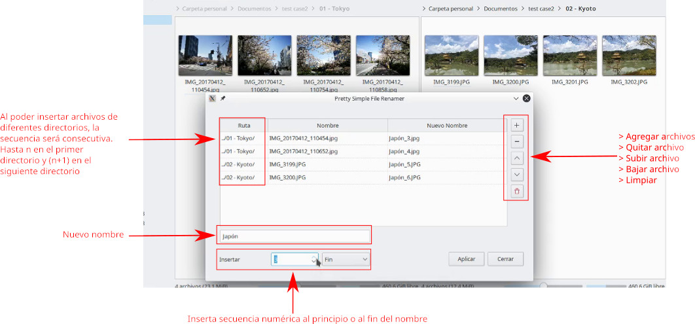
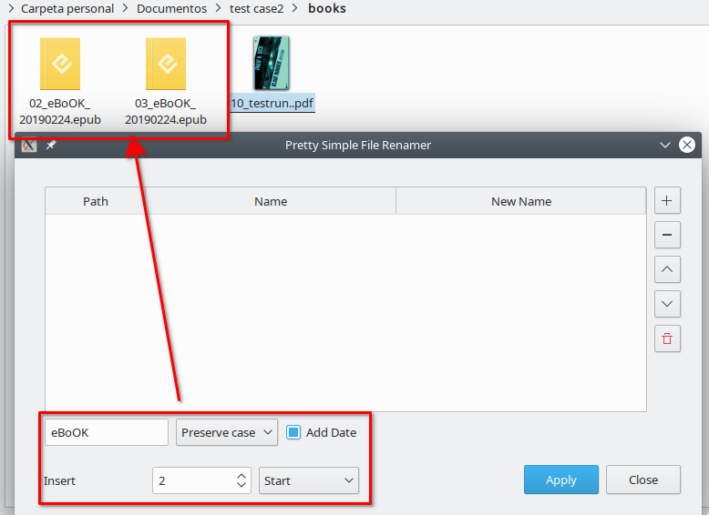

# psimplerenamer
A pretty simple file renamer for Linux.

I wanted to write a simple file renamer extension for Nemo (similar to Dolphin's) but end up writing a standalone application in Python.
I tried to keep the <i>"Simple by default, powerfull when needed"</i> motto

This app is supposed to be quite simple, but it has enough features to make bulk file renaming easy.
If you are a power user, I suggest you more powerful applications such as Inviska, Gprename or Krename.

What it does:
- Rename different files in different directories. I though it would be nice to have a bulk file renaming using consecutive numbers in different folders.
- Choose an initial/ending sequence number.
- Add/remove files to rename.
- Clean list of added files
- Postfix/sufix sequence option.
- Uppercase/Lowecase/Preserve Case.
- Add system date in YYYYMMDD format.

It doesn't:
- use regular expressions. 

To-do (next releases):
- Possibility to use letters instead of numbers.

Wishlist:
- Drag & Drop

How to use it:
- If you have pyQT5 installed: download all the files from "src" and run "./psimplerenamer.py"
- If you want to run the blob: download the binary files from "binary" and run "psimplerenamer""

PS: Added a deb package <a href='binary/psimplerenamer_0.2_all.deb'>psimplerenamer_0.2_all.deb</a>

